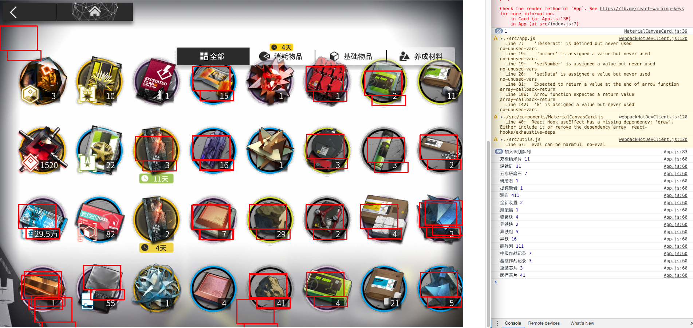

## 为什么挖坑

+ https://ark-nights.com/
+ https://planner.penguin-stats.io/

为了在上面2个网站中导入库存数据

## 思路
1. opencv 定位
2. tessreact 识别

## 不挖了
思路跑通之后发现识别率过低，我太难了，不玩了。调参预定

还是先感谢 arkgraph ，白嫖了材料图片和数据。

垃圾代码上传上来，给想做的人提供下参考。是我太菜了（

